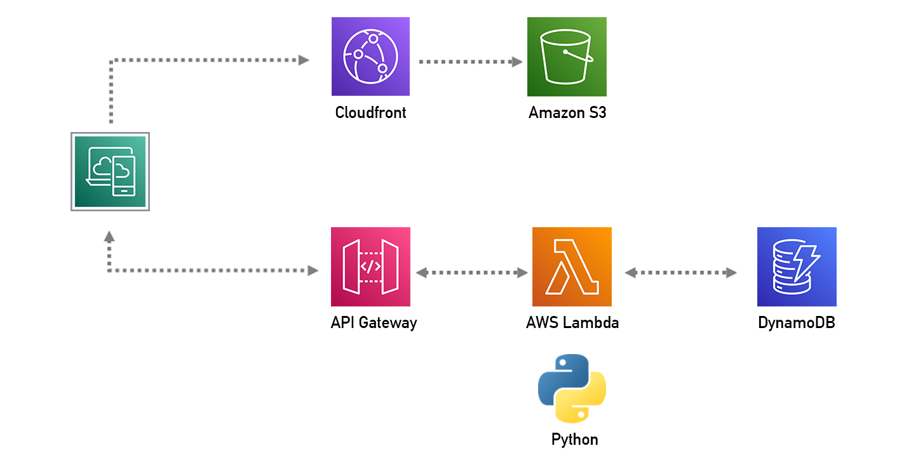
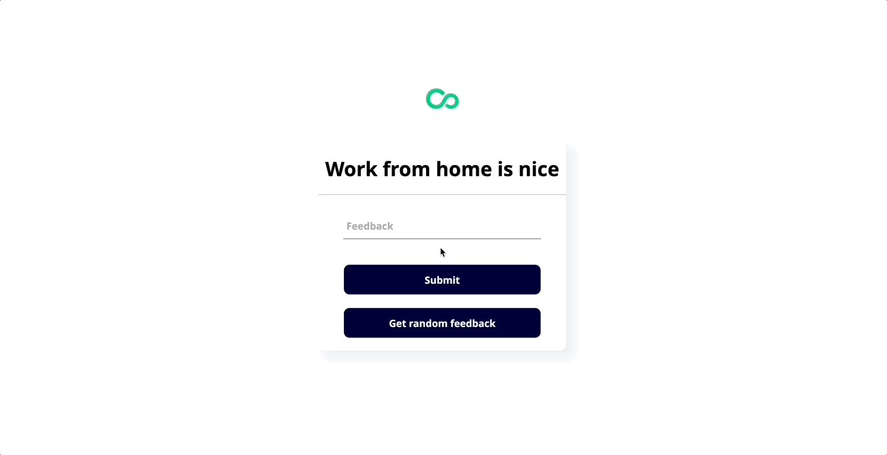
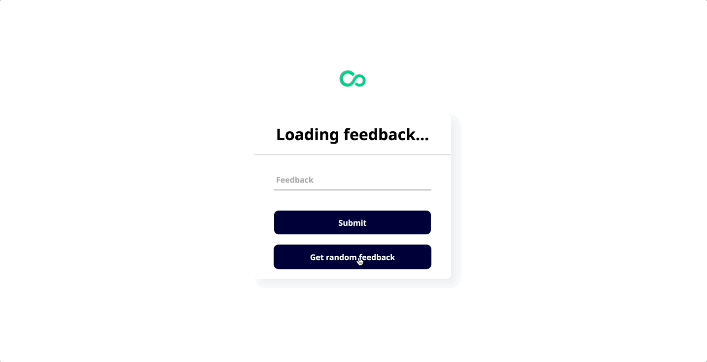
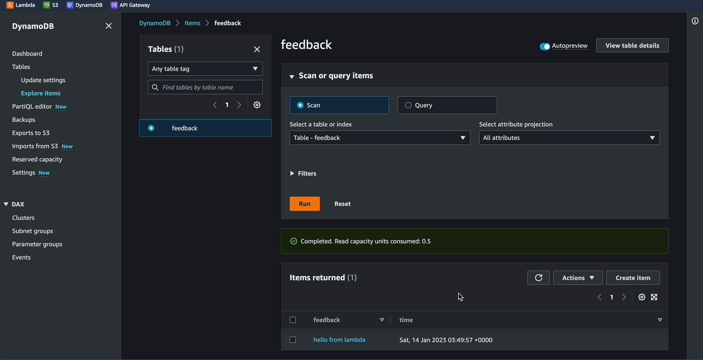
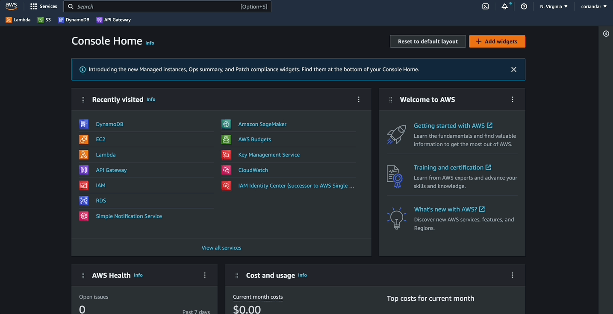

#### Link to the website
http://feedback-new.s3-website-us-east-1.amazonaws.com

## Project
Cotiss is built specifically to help organisations be more effective in how they buy & supply goods and services. They’re a B2B company that creates software for companies to track their spending and make better business decisions.

As Cotiss has grown over the years, the need for collecting feedback internally and externally has become a more prominent issue. Cotiss leadership is looking for a simple website where employees can anonymously submit feedback. To encourage employees to share honestly, they want a randomly selected piece of existing feedback to be displayed on the site on each page load. 

The UX design is simple; a random piece of feedback displayed on each page load, and a box at the bottom of the page with a submit button to add new feedback to the feedback bank. 

## Purpose
The main goal is to gain a better understanding of how to build with AWS service through building a solution for a real-world problem. The project was provided through NextWork as part of their Summer of AWS program.

## Prerequisite
- Basic html, css, js knowledge
- Basic python knowledge
- Basic understanding of AWS services

------------------------------------------------------------------------------------------

## Implementation - Serverless
- [Amazon DynamoDB][1.1] to be the database for where we get/post feedback
- [AWS Lambda][1.2] to create functions that read/write to database, using python
- [Amazon API Gateway][1.3] to create a REST API that connects to the web app
- [Amazon S3][1.4] to host the web app
- [Amazon Cloudfront][1.5] to deliver web app to edge locations
- [AWS Management Console][1.6] to setup and configure services

[1.1]: <https://aws.amazon.com/dynamodb/>
[1.2]: <https://aws.amazon.com/lambda/>
[1.3]: <https://aws.amazon.com/api-gateway/>
[1.4]: <https://aws.amazon.com/s3/>
[1.5]: <https://aws.amazon.com/cloudfront/>
[1.6]: <https://aws.amazon.com/console/>

## Demo
<!-- HD 60fps -->
App posting feedback:

App getting random feedback:

Feedback added to DynamoDB:

------------------------------------------------------------------------------------------

## Getting started
- Set your region, and make sure it is consistent across services.

## Documentation
The documentation is divided into several sections, the order is recommended:

1. [Create database][2.1]
2. [Create lamda functions][2.2]
3. [Create REST API][2.3]
4. [Host web app][2.4]
5. [Deploy to CDN][2.5]
6. [Clean up][2.6]

[2.1]: <docs/createDynamoDB.md>
[2.2]: <docs/createLambdaFuncs.md>
[2.3]: <docs/createRestAPI.md>
[2.4]: <docs/hostWebApp.md>
[2.5]: <docs/deployCDN.md>
[2.6]: <docs/cleanUp.md>

## Team

| Name     | GitHub           | Role           |
|:---------|:-----------------|:---------------|
| Eric Heo | [ericheose][3.1] | Lead Developer |
| Tony Yee | [coriandar][3.2] | Developer     |

[3.1]: <https://github.com/ericheose>
[3.2]: <https://github.com/coriandar>

------------------------------------------------------------------------------------------
