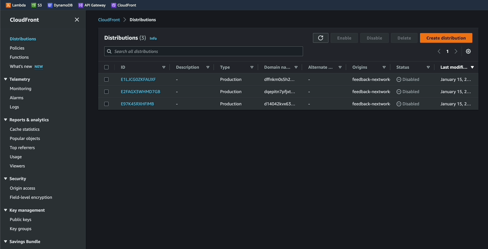
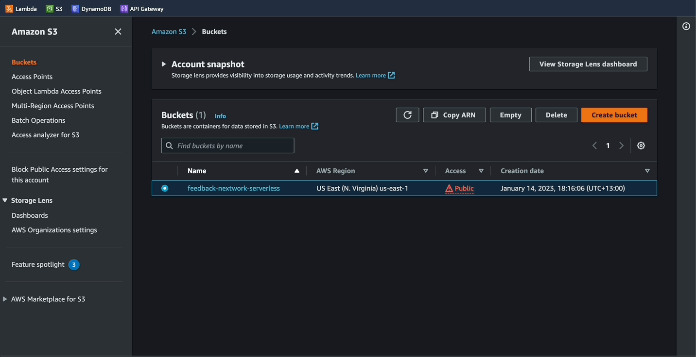
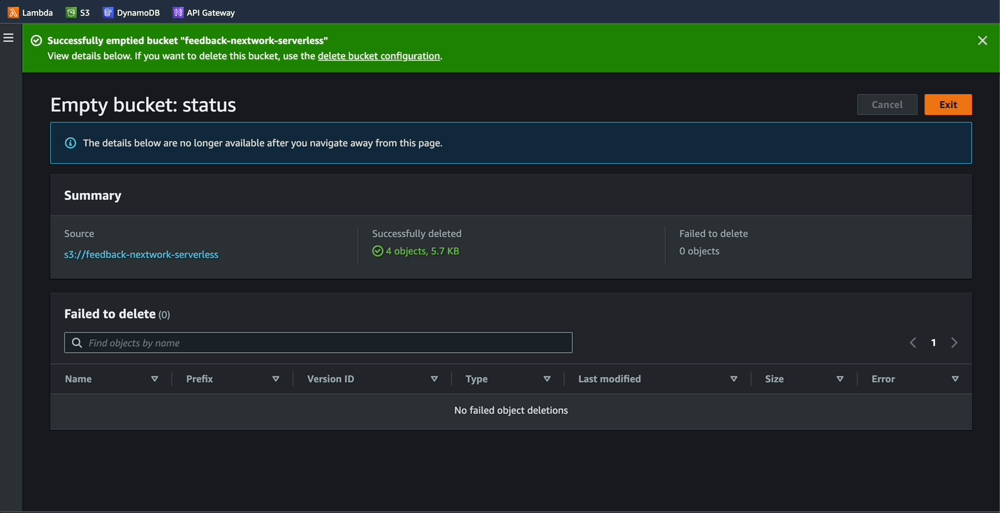
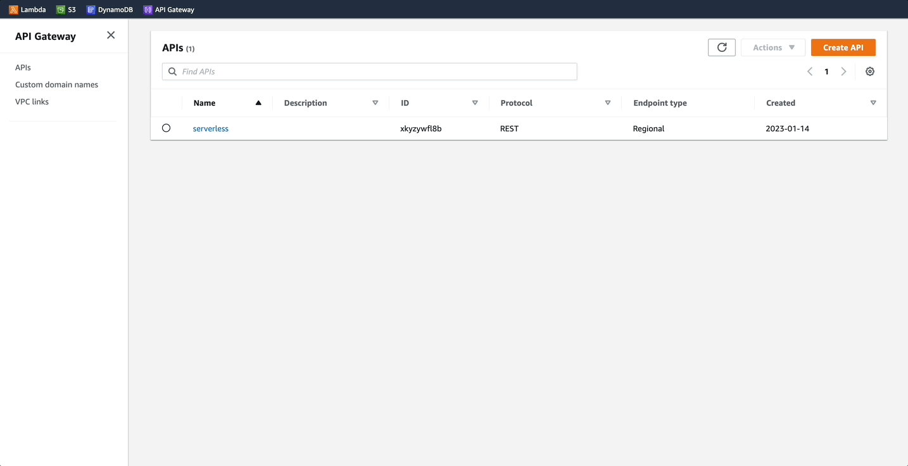
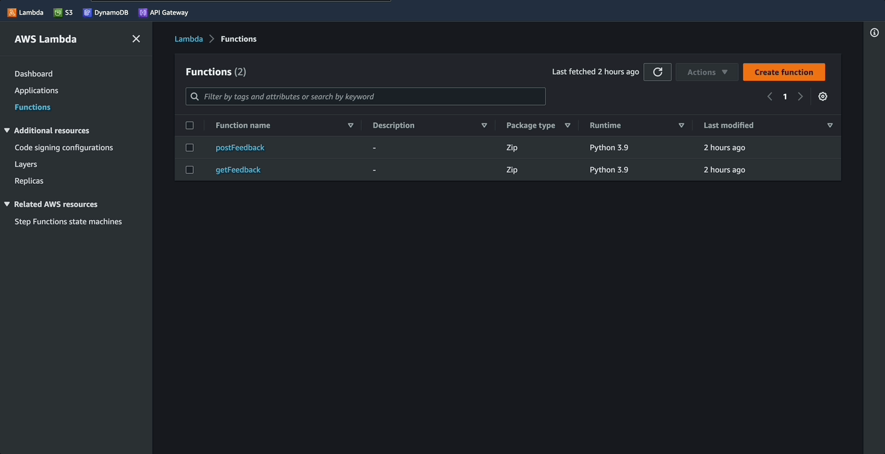

# Clean up

## Cleaning up Cloudfront distribution
- Distrubutions must be diabled before deleting
- After disabling, it may take a few minutes until the delete option is available

------------------------------------------------------------------------------------------

## Cleaning up S3 bucket
- S3 buckets must be empty prior to deleting
- Use the `empty` button or the delete button, follow prompts
- Select the bucket again, click `delete`, follow prompts

------------------------------------------------------------------------------------------

## Cleaning up Amazon API Gateway
- Select the API, click `actions`, then delete

------------------------------------------------------------------------------------------

## Cleaning up AWS Lambda Functions
- Select the functions, click `actions`
- Type in `delete` and then click delete button

------------------------------------------------------------------------------------------

## Cleaning up Amazon DynamoDB
- Select table and then `delete`
- Follow the prompts

------------------------------------------------------------------------------------------

### Next -> [Project Overview][3.1]
[3.1]: <../README.md>