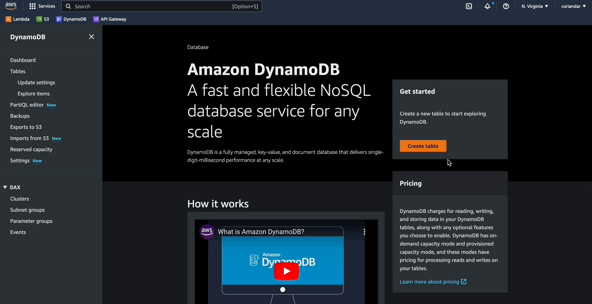
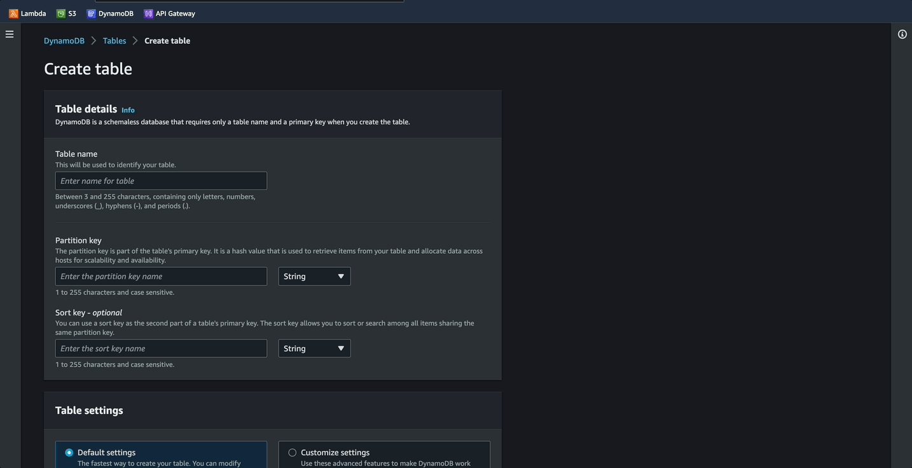
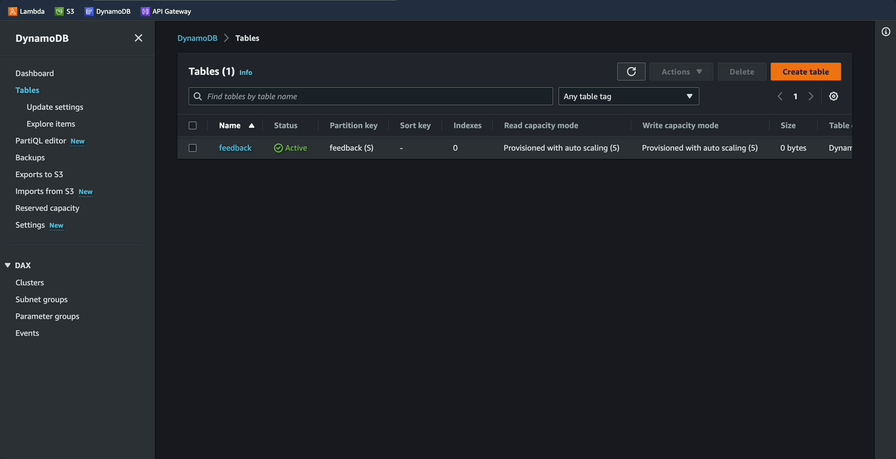

# Create database

## Amazon DynamoDB
- A fully managed, serverless, key-value NoSQL database
- It is designed to run high-performance applications at any scale
- stores the data in key-value pairs, like a JSON object

## Introduction
The application must be able to store and retrieve feedback entered by the users. On each page load, and submission it is required for the app to retrieve a random piece of feedback and display it. On each submission it is required that the entry is stored with a time stamp.

## Terminonlogy and Concepts
- **Table:** This is simply a collection of data. A table is specifically the structure in which DynamoDB stores this data. In our case, we will have a books table to store our product catalog.
- **Item:** A single data record in a DynamoDB table. It is comparable to a row in a relational database. Each item in our table will correspond to a book in our product catalog.
- **Attribute:** A single data element of an item. It is comparable to a column in a relational database. However, unlike columns in a relational database, attributes do not need to be specified at table creation, other than the primary key. Attributes for us will consist of elements such as Title, Author, and Category.
- **Primary key:** A primary key is a unique identifier for a single item in a DynamoDB table. When you create a table, you must specify the primary key name and type. The primary key uniquely identifies each item written to a table. A simple primary key consists of a single attribute, and a composite primary key consists of two attributes. For example, we will be using a combination of the Title and Author as the unique identifier for each book.
- **PartiQL:** This is a SQL-compatible query language that enables you to codify your DynamoDB data operations using SQL syntax.

## Data Model
As DynamoDB is a nonrelational database, it is not necessary to specify the full schema at when creating the table. Only the primary key is required. This reduces the upfront cost of designing the data model as it is easily modifiy the schema as the application's requirements change. Time should always be take to design an appropriate data model that meets the requirement in the applications logic. The design of the data model should consider the data access need for both reading and writing data.

As this app is relatively simple, the data model for this application will be very simple, with it only containing the feedback as the primary key, and a timestamp, both are stored as strings: 

- **feedback (string):** piece of feedback
- **timestamp (string):** timestamp generated by the lambda function

------------------------------------------------------------------------------------------

## Implementation 
- This part will cover the process of creating the database, we will then use lambda in the next section to write our first piece of data, and read from the database.You can also view the python code here [`../lambda/`](../lambda/)

### Step 01:
- Click on `Create Table`

### Step 02:
- Name the table `feedback`
- For the partition key enter `feedback` with type string
- Partition key is the primary key of the table
- Scroll down, keeping the default settings.
- Click on `create table`

### Step 03:
- Wait for the status to show `active`
- To view the items in the table, click on the table name
- Then the orange button at the top right `explore table items`
- Clicking the `refresh` button will fetch newly added items
- Currently no items have been added, we will add the first item in the next step

------------------------------------------------------------------------------------------

### Next -> [Create lamda functions][2.2]
[2.2]: <createLambdaFuncs.md>