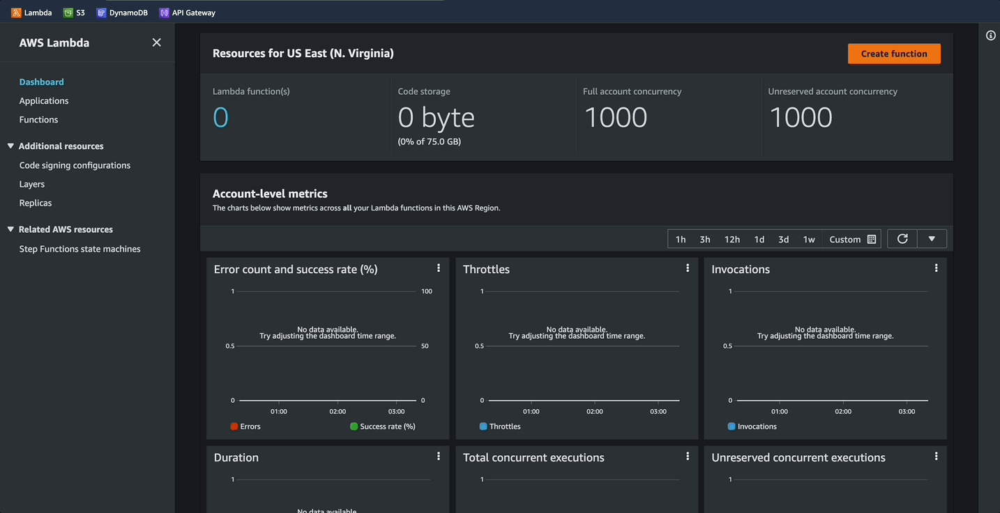
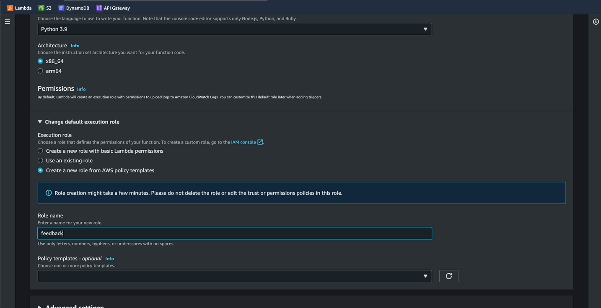
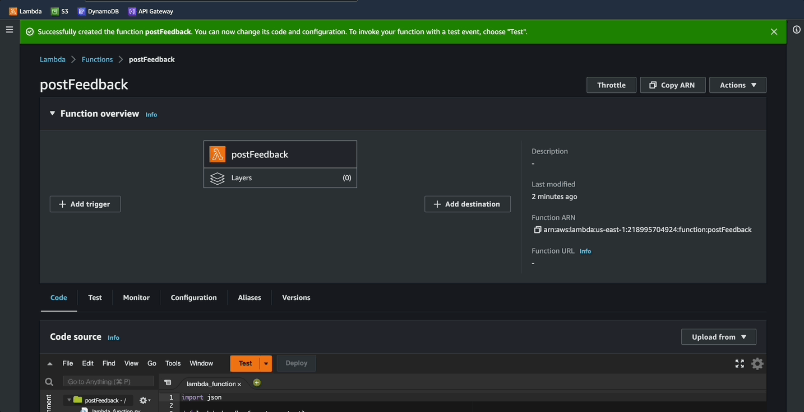
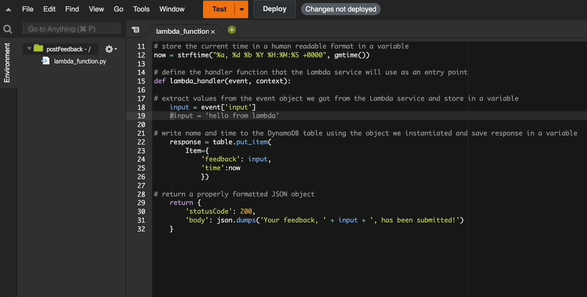
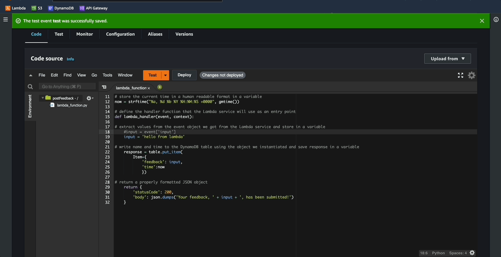
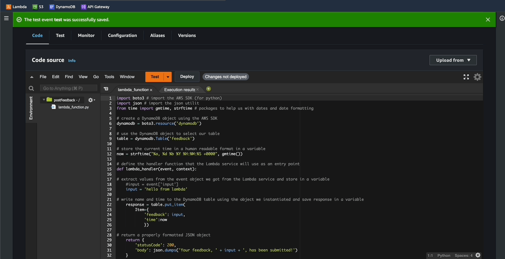
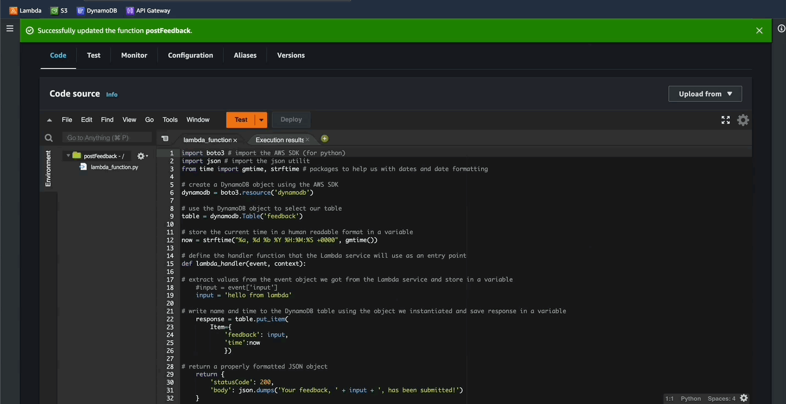
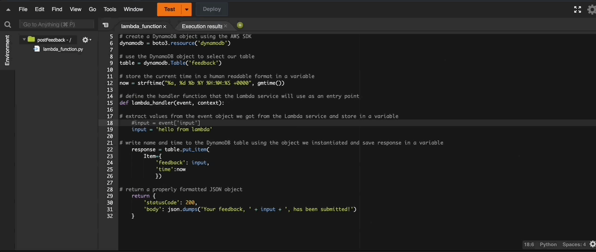
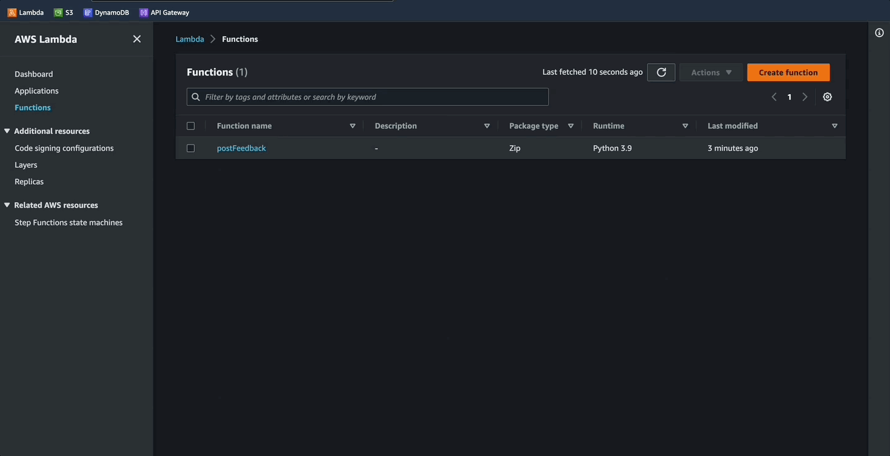
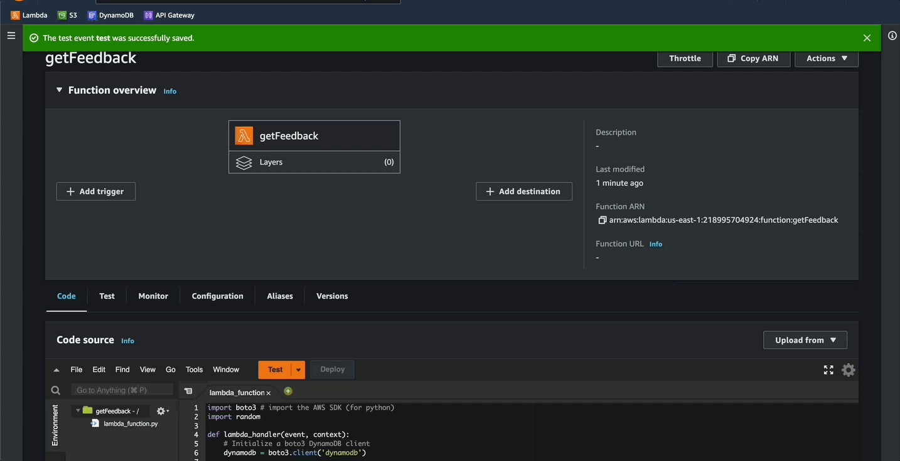

# Create lamda functions

## AWS Lambda
- A serverless, event-driven compute service
- Able to run code for virtually any type of application or backend service without provisioning or managing servers.
- In this application `lambda` will be triggered using `API Gateway` 

## Terminonlogy and Concepts
- **Serverless function:** Piece of code that will be executed by a compute service, on demand.
- **Lambda trigger:** The type of event that will make a Lambda (serverless) function run. 

### Step 01:
- Give the function a name, in this case `postFeedback`
- Use runtime of `python 3.9` or above
- Architecture `x86`

### Step 02:
- Under persmissions, click on `change default execution role`
- This gives the `lambda function` basic access to `dynamoDB`
- Select `create a new role from AWS policy templates`
- Give the role a name
- For the policy search for and select `simple microservice permissions`
- Click `create function`

### Step 03:
- 

### Step 04:

### Step 05:

### Step 06:

### Step 07:

### Step 08:

### Step 09:

### Step 10:

### Step 11:

### Next -> [Create REST API][2.3]
[2.3]: <createRestAPI.md>
