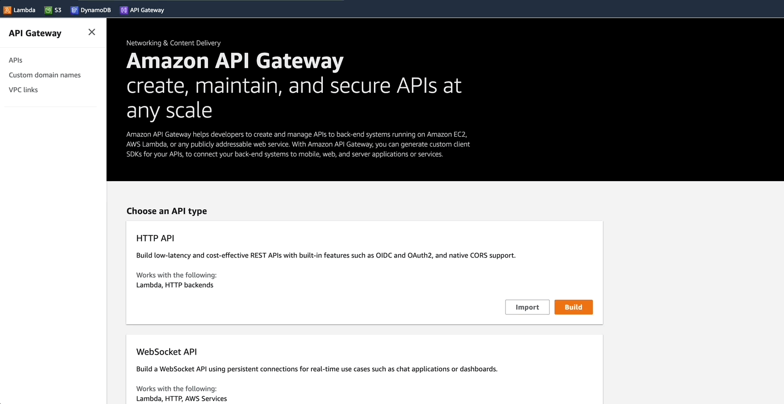
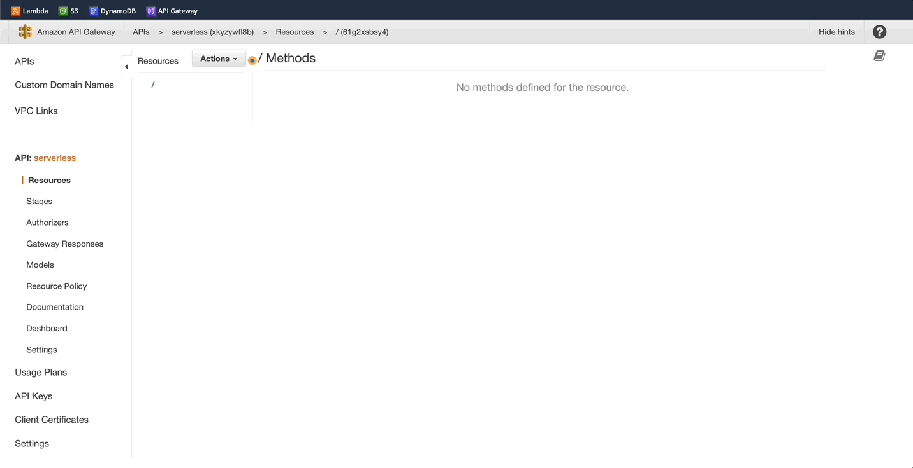
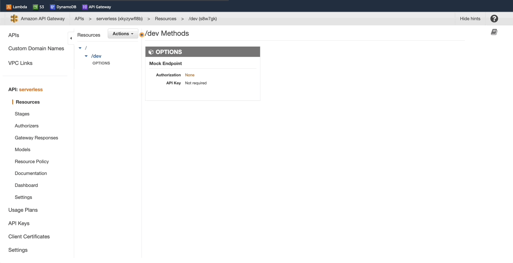
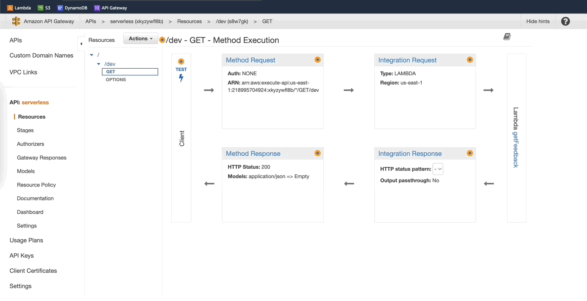
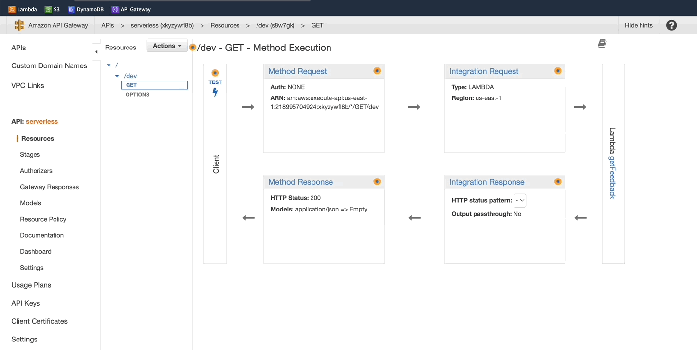
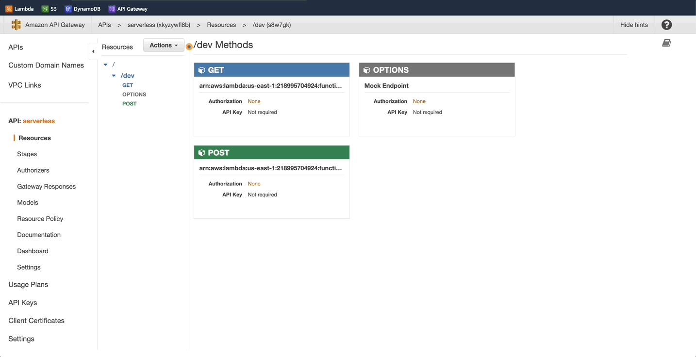
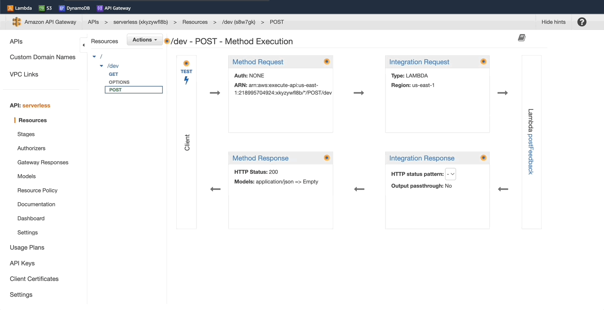
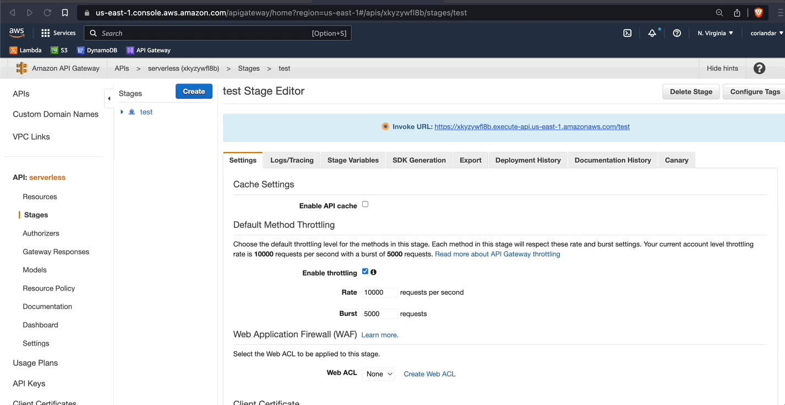

# Create REST API

## Amazon API Gateway 
- Fully managed service that allows creating a REST API that acts as the front-end for other services.
- Will allow the web app to invoke the API

### Next -> [Host web app][2.4]
[2.4]: <hostWebApp.md>