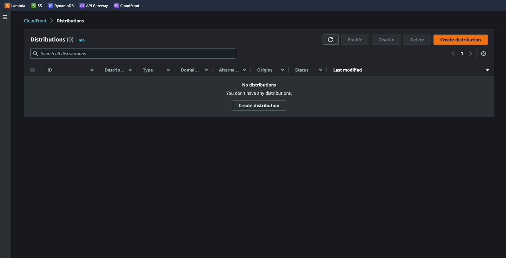
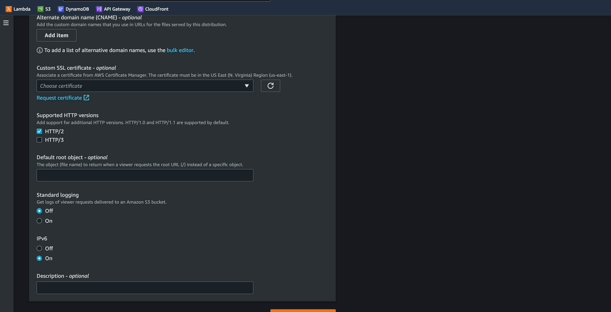
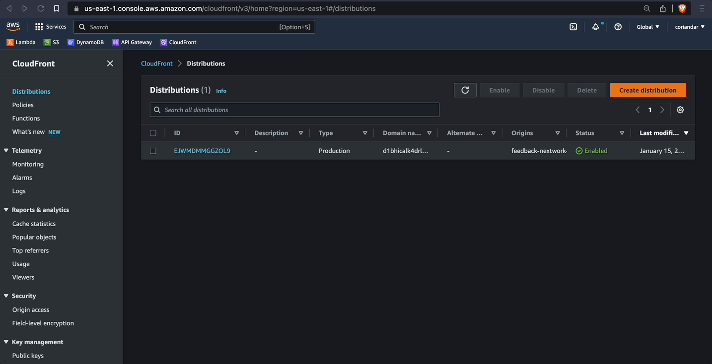

# Deploy to CDN

## Amazon Cloudfront
- CDN service built for high performance, security, and developer convenience.
- It will copy the app to edge locations around the world to improve speed in which app is served to users

------------------------------------------------------------------------------------------

## Implementation
### Step 01:
- Create distribition
- Click on origin domain and selec the S3 of the static website
- `ignore` the recommendation for switching endpoints

### Step 02:
- Scroll down until you reach the `settings` header
- In `default root object` input `index.html`
- Scroll down and click `create distribution`
- It may take a few minutes for it to deploy

### Step 03:
- It is deployed once the status is enabled and the timestamp has been updated
- Click on the `ID`
- Copy and paste the `Distribution domain name` into a new tab
- Test functionality, review `dynamoDB` for new items

------------------------------------------------------------------------------------------

### Next -> [Clean up][2.6]
[2.6]: <cleanUp.md>