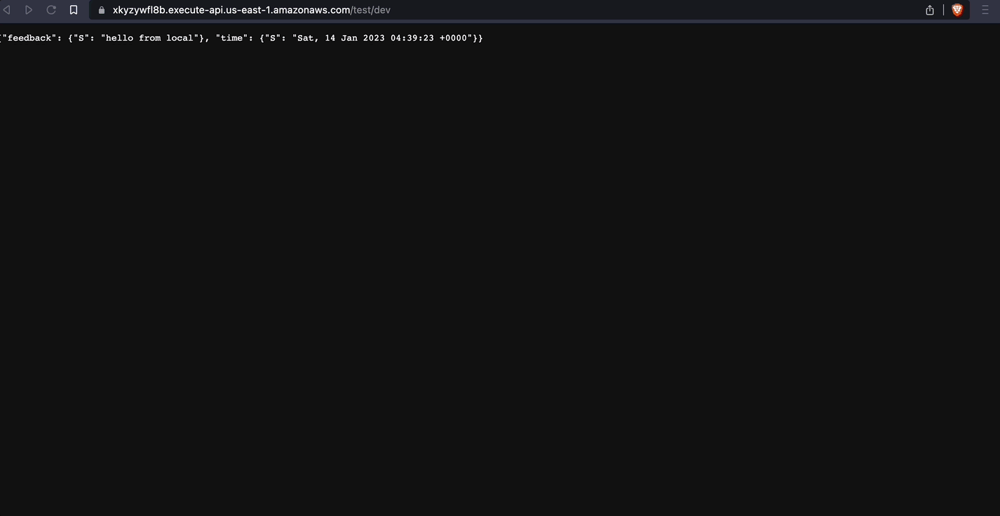
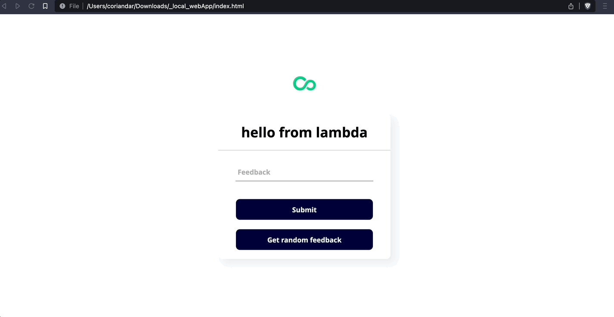
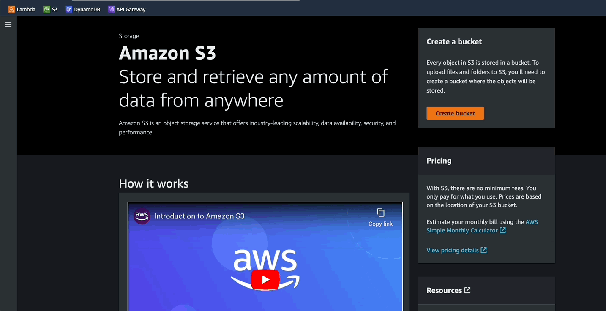
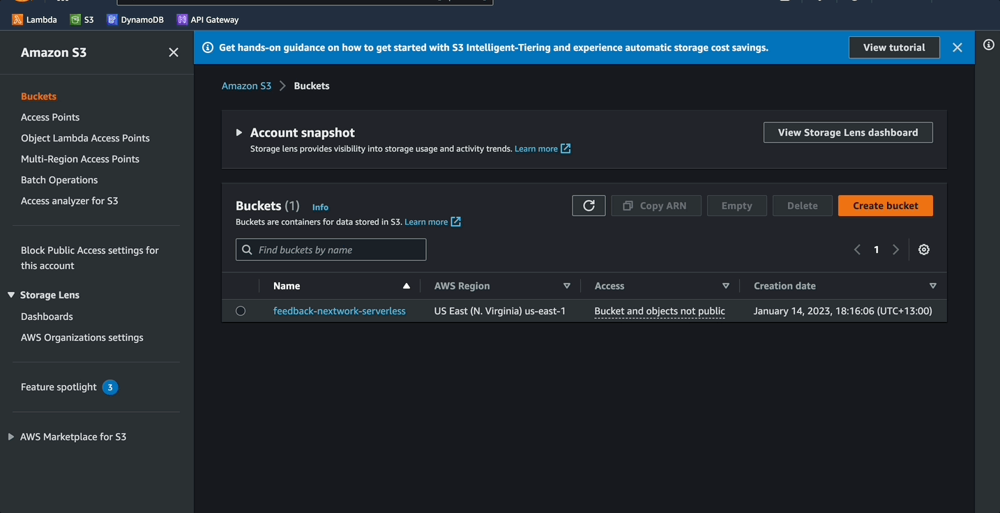
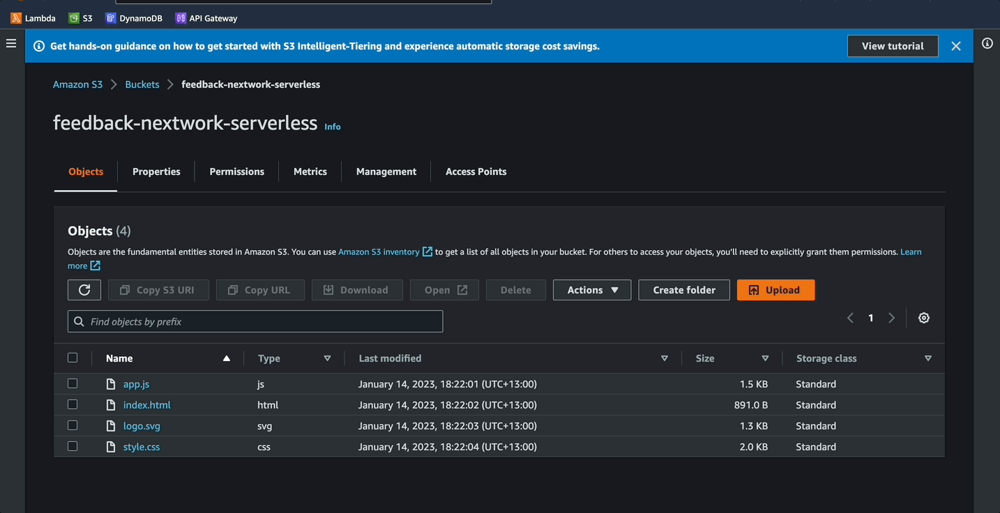
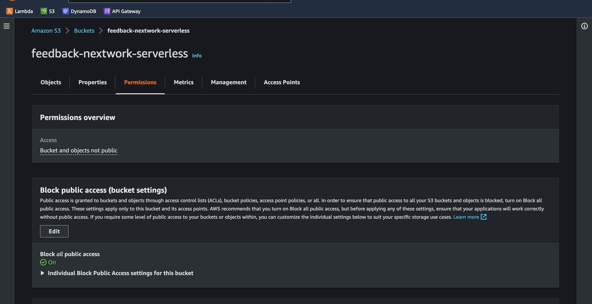
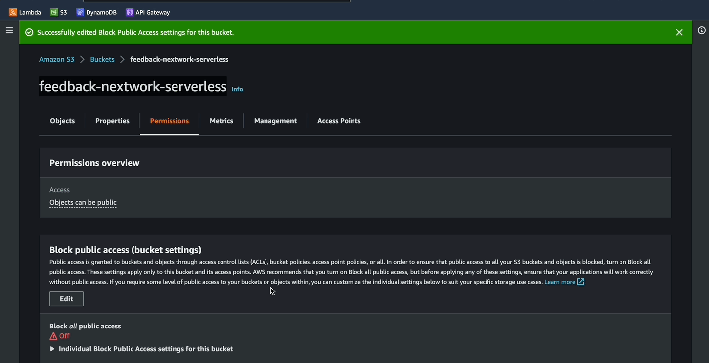

# Host web app

## Amazon S3
- An object storage service offering industry-leading scalability, data availability, security, and performance.
- Hosts static web resources including HTML, CSS, JavaScript, and image files which are loaded in the user's browser.
- JavaScript executed in the browser sends and receives data from a public backend API built using Lambda and API Gateway.

<!-- ## Terminonlogy and Concepts
**Static website:** -->

------------------------------------------------------------------------------------------

## Implementation
### Step 01:
- Copy the **appended** `invoke url`
- Go to the app.js file of the webApp
- Replace the empty string for `apiGateway`



### Step 02:
- Test functionality of the webApp locally
- Submit a new feedback through the ui
- Check `dynamoDB` for new entries



### Step 03:
- If the website is able to invoke the api, next step is to host it statically using S3 bucket
- Bucket name must be `globally` unique
- Create bucket



### Step 04:
- Click on the bucket name
- Upload files, click `upload`



### Step 05:
- In the permissions tab, edit `block public access`
- Uncheck all, save
- Follow prompt



### Step 06:
- In permissions tab, scroll to bucket policy and click `edit`
- Paste the code below 
- Make sure to change `Bucket-Name` to name of your bucket

```json
{
    "Version": "2012-10-17",
    "Statement": [
        {
            "Sid": "PublicReadGetObject",
            "Effect": "Allow",
            "Principal": "*",
            "Action": [
                "s3:GetObject"
            ],
            "Resource": [
                "arn:aws:s3:::Bucket-Name/*"
            ]
        }
    ]
}
```



### Step 07:
- In the properties tab, scroll to `static website hosting`
- Enable it
- Input `index.html` for the index document


### Step 08:
- Open the url and test functionality
- Check `dynamoDB` for new items



------------------------------------------------------------------------------------------

### Next -> [Clean up][2.5]
[2.5]: <cleanUp.md>