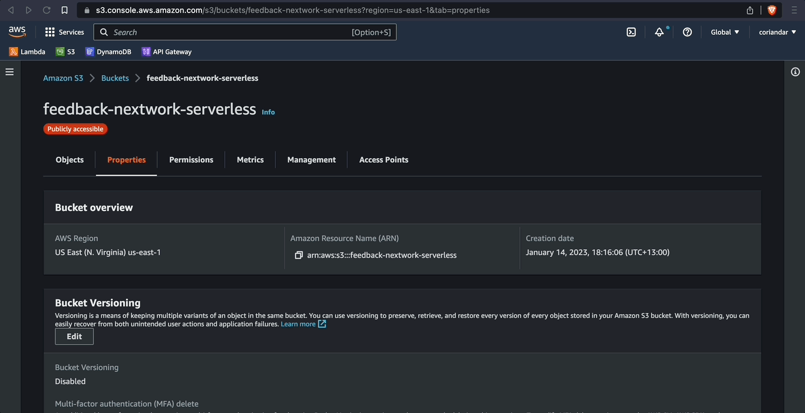

# Host web app

## Amazon S3
- An object storage service offering industry-leading scalability, data availability, security, and performance.
- Will be used to statically host the web app


https://docs.aws.amazon.com/AmazonS3/latest/userguide/website-hosting-custom-domain-walkthrough.html

```json
{
    "Version": "2012-10-17",
    "Statement": [
        {
            "Sid": "PublicReadGetObject",
            "Effect": "Allow",
            "Principal": "*",
            "Action": [
                "s3:GetObject"
            ],
            "Resource": [
                "arn:aws:s3:::Bucket-Name/*"
            ]
        }
    ]
}
```
replace bucket-name with your won bucket


### Step 01:


### Step 02:


### Step 03:


### Step 04:


### Step 05:


### Step 06:


### Step 07:


### Step 08:


### Step 09:


### Next -> [Clean up][2.5]
[2.5]: <cleanUp.md>